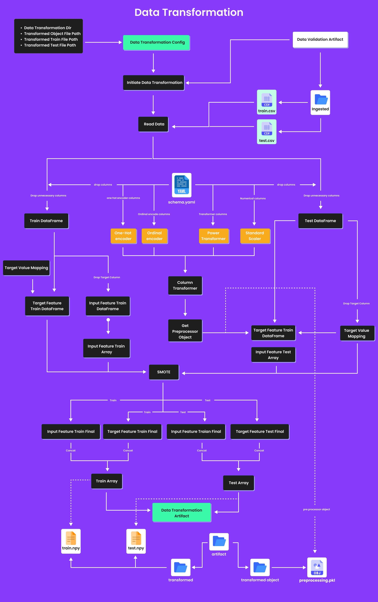

# US Visa Approval Prediction

This project predicts the approval status of US visa applications using machine learning and deep learning models, integrated with an MLOps pipeline for streamlined deployment.

## Overview
Visa applications are often complex and influenced by multiple factors. This project focuses on building a robust model that predicts visa approval based on features like education, job experience, and company-specific information. The project also demonstrates how MLOps practices can be used to deploy and monitor such predictive models effectively.

---

## Problem Statement  

Given a set of **features** related to the applicant and company, the goal is to predict whether a visa application will be **_approved_** or **_rejected_**.  

## Features
Key features in the dataset include:
| **Feature Name**           | **Description**                                                                 |
|----------------------------|-------------------------------------------------------------------------------|
| `Continent`               | The continent of employment: Asia, Africa, North America, Europe, South America, Oceania. |
| `Education_Level`         | The education level of the individual: High School, Bachelor's, Master's, Doctorate. |
| `Job_Experience`          | Indicates whether the individual has job experience: Yes/No.                   |
| `Required_Training`       | Specifies if training is required for the job: Yes/No.                         |
| `Employee_Count`          | Number of employees in the company: 15,000 to 40,000.                          |
| `Region_of_Employment`    | Geographical employment region: West, Northeast, South, Midwest, Island.       |
| `Prevailing_Wage`         | The prevailing wage range: 700 to 70,000.                                      |
| `Contract_Tenure`         | Duration of employment contract: Hour, Year, Week, Month.                      |
| `Full_time_Employment`    | Indicates if the position is full-time: Yes/No.                                |
| `Company_Age`             | Age of the company: 15 to 180 years.                                           |


### 1. **Data Ingestion**
   - This phase involves collecting data from the source (e.g., MongoDB), exporting it to a feature store, and splitting it into training and testing datasets for further processing.
   - The final output includes a `Data Ingestion Artifact` that stores train (`train.csv`) and test (`test.csv`) files.
   


### 2. **Data Validation**
   - The data validation stage checks the input data for issues like missing columns, numerical/categorical inconsistencies, and data drift.
   - It ensures the data meets the defined schema and outputs a `Data Validation Artifact` with validation status and drift reports.
    

### 3. **Data Transformation**
   - The transformation phase processes raw data using encoders, scaling, and SMOTE (for handling imbalanced data).
   - It outputs transformed train and test datasets as `.npy` files and generates a preprocessing object (`preprocessing.pkl`).
   


### 4. **Model Trainer**
   - In this phase, the model is trained using the transformed data, and various algorithms are evaluated to determine the best-performing model.
   - The final trained model and metrics are saved as artifacts (`model.pkl`), ready for evaluation.
   


### 5. **Data Evaluation**
   - The trained model is compared to the existing best model (from S3) using evaluation metrics like the F1 score.
   - If the new model performs better, it is accepted and stored with its evaluation results.
   


### 6. **Model Pusher**
   - This stage pushes the trained model to an S3 bucket or other deployment location for production use.
   - The `Model Pusher Artifact` ensures the model is saved with its path for deployment or further usage.
   

## Deployment
The deployment process involves:
- **Docker:** Containerized application for scalability and reproducibility.
- **Cloud Services:** Hosting the solution on cloud platforms.
- **Self-Hosted Runner:** Automating CI/CD workflows.
- **Workflows:** Automated pipelines for training, validation, and deployment.

---

## Getting Started
### Prerequisites
- Docker
- Python 3.8+
- Cloud account (AWS/GCP/Azure)
- GitHub Actions

### Installation
1. Clone the repository:
   ```bash
   git clone https://github.com/your-username/us-visa-approval-prediction.git
   cd us-visa-approval-prediction
